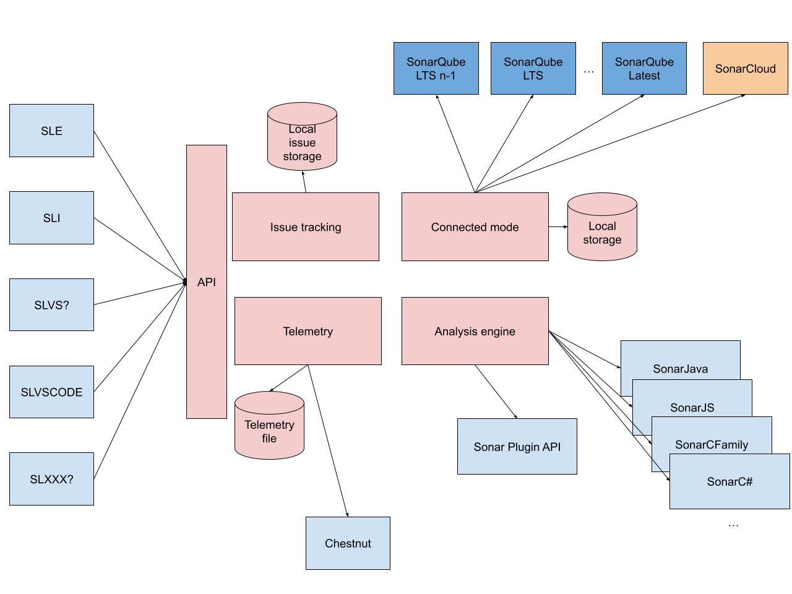

# Move more responsibilities from clients to the core

# Why?

SonarLint Core is a Java library, shared by the 3 "Java based" flavors of SonarLint (SLE, SLI, SLVSCODE). Its initial mission was to replace the scanner-engine: load and execute plugins. Then connected mode related code was added (WS + storage).
A clear API for IDEs was initially maintained, but then we decided it was useless, since all IDEs were evolving under the control of the same people.
The 2 main entry points are StandaloneSonarLintEngine and ConnectedSonarLintEngine. IDEs are responsible to instantiate as many of those "engines" as they need (1 standalone, 1 connected per connection).
There are also a lot of small utility classes that are used by IDEs without using the "engines".

The problems:
1. API STABILITY: different sub-teams are consumer of SonarLint Core, having a very unstable API is not comfortable
2. DUPLICATION: latest added features require an overall view of the "engines", so we had no choice but to put the logic in each IDEs. Exemple, when an open hotspot request arrives, we need to find the connection it refers to. This logic can't happen in the core today.
  => lot of duplicated logic:
    * open hotspots
    * telemetry
    * engine management (start/stop/sync/…) 
    * binding management (bind/unbind/compute prefixes/…)
    * VCS branch management 
    * analysis scheduling 
    * local issue tracking
3. RUNTIME / TECH STACK: relying on IDE runtime to execute most of our logic (including analysis) is a blocker for innovation.
people are still asking support for Java 8 runtime in Cobol IDEs
hard to use Kotlin libraries in OSGi context
hiring would be more attractive if a big part of the codebase was in modern Java (or another modern language)
we could kill IDE performances, and this is hard for us to measure
4. TESTABILITY: SonarLint Core has always been intensively tested. Headless testing is much cheaper than IDE UI tests. On the IDE side, it was accepted to have low automated coverage test, relying on manual testing, dogfooding and community to find UI bugs. Now that we put more and more logic in IDEs, where the coverage is low (or absent), there is a higher risk of regressions.
5. CONSISTENCY: We agreed a long time ago to not focus too much on having the same experience in all IDEs. It was considered better to have a "native" experience. Still we are now in a situation where the UX is different between IDEs, with no good reasons.
6. OWNERSHIP of the project. In a situation where there will be one bubble per IDE, "consuming" SLCORE, who would be responsible to maintain it (checking failing ITs, updating dependencies, …) and who is allowed to introduce functional changes? Today it is not clear.

# Why Not?

Possible reasons for not doing anything (or even putting more in IDEs):

1. RIGIDITY: we will force the same behavior in all IDEs. In the past, it has been considered as bad. SonarLint should integrate "natively" is IDEs, which means following IDE "patterns".
the configuration and UI will stay under control of the IDE side
the part we should put in the core should be the "original" SonarLint experience (analysis, issue tracking, connected mode) so it should not suffer from comparison with existing IDE features
2. SHARED RESPONSIBILITY: having a shared component between multiple teams or bubbles is difficult in terms of organization.
I guess sonar-security or sonar-analyzer-common libraries are in the same situation, we could learn from the LT experience.
3. PERFORMANCE: having SLCORE embedded into SLE/SLI allows to share Java objects/integrate into IDE VFS. By running out of process, we will probably have to duplicate objects in memory. The RPC communication will also be slower than "in-JVM" communication.
we should design the API to limit number of RPC calls
we should pay attention to memory consumption, but it will be easy to monitor since SonarLint backend will have its own process
4. COMPLEXITY: SLCORE as a library is simpler to use (at least in Java IDEs) than having to manage a separate process
5. INCREASING DISTRIBUTION SIZE: if we package our own runtime

# What?
1. API STABILITY: clear interface used by IDEs. Avoid breaking changes, document changes, deprecate/keep backward compatibility.
2. DUPLICATION: move code into SLCORE, but not as a toolbox/library, more as a set of services, with a small and hopefully stable interface. IDEs should ideally only keep UI, settings, and IDE specific integration (extension points, …)
3. RUNTIME: design SLCORE as a standalone process that communicates with IDE using RPC (like SLLS) . The API should support that (no more full Java objects leaking between IDE and Core, avoid too granular/frequent calls). IDE specific code can stay longer with old runtime compatibility.
4. TESTABILITY: we should be able to write a lot of new tests, concerning advanced interactions between components (connected mode storage, VCS, …). For example: user switches its project branch, that should recompute the matching SQ branch, then sync issues, and report to IDE
5. CONSISTENCY: find the right boundaries between IDE specific behavior and common part. Don't allow too much "customization" of the backend to avoid testability hell and no consistency. Document intended IDE specific behavior.
6. OWNERSHIP: if we take inspiration from the SonarQube team organization, we don't think having a dedicated isolated bubble owning SLCORE is a good solution. We think most of the functional changes should be driven by IDEs. We will form squads composed of IDE specialists (= frontend) + SLCORE specialists (= backend).

## What should stay in each IDE?
IDEs should keep control on the configuration:
* connection definition
* bindings
* exclusion
* rules configuration
* user preferences (subscribe to dev notifications, …)

This is important, because configuration can be scoped/stored at different levels (user, ide instance, project, module, …) and benefit from IDE specific configuration synchronization. Also some settings should be stored in a secure storage, that is also IDE specific.

IDEs are responsible for presentation (issues, flows, rule descriptions, …)

Should IDEs keep responsibility of analysis scheduling? Maybe not.

IDEs should be responsible for hooking into IDE editors to broadcast source file changes.

IDEs should be responsible to collect analysis configuration (Java classpath, .NET version, …)

# Target architecture

